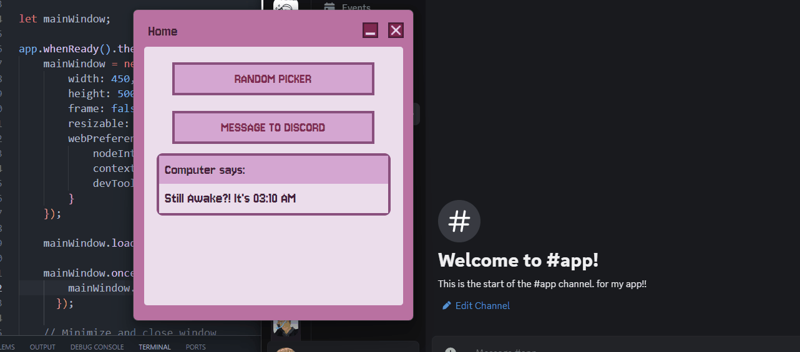

# 🚀 Electron.JS HTML App
> Building an application using `electron.js`, turning a HTML to an executable app.

### What is Electron.js?
It is a framework for building desktop apps using front-end web development languages by embedding **Chromium** and **Node.js** into its binary, allowing the creation of an app without any native development experience through one JavaScript codebase. You can learn more about it [here](https://www.electronjs.org/docs/latest/why-electron).

## 💻 Application
### 🎞️ Demo


### ✨ Features
- A simple greeting which also shows current time
- Has a Random Picker, picking random item from list
- Allows text messages to be sent via Discord Webhook

### ⚙️ Installation
1. Clone the repository:
```
git clone https://github.com/DynoDev/electron-html-app.git
cd electron-html-app
```
2. Install necessary dependencies:
```
npm install
```
3. Run the application in development mode by using:
```
npm start
```
>[!WARNING]
> As one of the features uses my personal Discord Webhook private API key, the URL is stored in a dotenv file that has been ignored by git due to security reasons. In order to properly test the **text message feature**, you can [create your own Discord Webhook](https://support.discord.com/hc/en-us/articles/228383668-Intro-to-Webhooks) and set it up based on the given .env.example file.

### 🎀 Building
To build and create an executable file for the application, you can run:
```
npm run dist
```
The packaged app will be stored in the `/dist` directory.